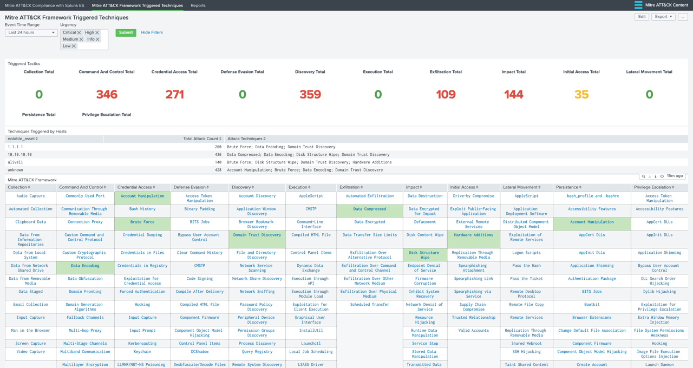

.. _userguide:

**********
User Guide
**********

By default, this application comes with 2 views.

1. :ref:`MITRE ATT&CK Compliance with Splunk ES<compliance_view>`

2. :ref:`MITRE ATT&CK Framework Triggered Techniques<triggered_attacks_view>`

3. :ref:`How To Match a Correlation Search with Framework<how_to_analytic_story>`

.. _compliance_view:

MITRE ATT&CK Compliance with Splunk ES
======================================

Each cell containing a technique is colored based on the percentage of enabled correlation searches.

If there isn't any related correlation searches, the cell is left uncolored.

If there are available correlation searches within Enterprise Security, then cells are colored based on percentage of enabled/active ones.

Currently the ranges are set as follows:

* low: 0-30% enabled
* medium: 30-50% enabled
* high: 70%+ enabled

You can mouse over to the cells that contain techniques in order to view the number of available and enabled correlation rules that are specific to that technique.
  .. image:: _static/mitreapp_setup3.png

.. _triggered_attacks_view:

MITRE ATT&CK Framework Triggered Techniques
===========================================

This dashboard/form has filtering options based on "**Event Time Range**" and "**Urgency**" level of Notable Events.  Currently following panels are available:

1. **Triggered Tactics**: Shows an overview of number of triggered Notable Events according to MITRE ATT&CK tactics.

2. **Techniques Triggered by Notable Assets**: Shows the number of triggered Notable Events according to MITRE ATT&CK techniques grouped by Notable Assets.  ``notable_asset`` is populated by ``src``, ``dest`` or ``user`` from related Data Models.

3. **MITRE ATT&CK Framework**: Provides a detailed match of triggered correlation searches with techniques and colored based on urgency level.

.. _how_to_analytic_story:

How To Match a Correlation Search with Framework
================================================

The view in the application utilized *Analytic Stories* that are tagged with the *Correlation Searches*.  Hence, in order to associate a *Correlation Search* with MITRE ATT&CK Techniques, you will need to create a new *Analytic Story* and add your *Correlation Search* with the appropriate tags.

**Note:** Please go to Splunk Documentation on `how to create a Correlation Search <https://docs.splunk.com/Documentation/ES/latest/Admin/Createcorrelationsearches>`_ .

For example, if we want the *Correlation Search* "**Brute Force Access Behavior Detected**" to be associated with "**Brute Force**" Technique under "**Credential Access**" tactic, we need to perform the following steps:

1. Go to "**Configure --> Content --> Content Management**" from Enterprise Security Application menu.  Click on "**Create New Content**" and select "**Analytic Story**"

.. image:: _static/analyticstory1.png

2. Enter a **Name** and fill other details as necessary for this analytic story.  Click on "**Add Search**" and select "**Brute Force Access Behavior Detected**"

.. image:: _static/analyticstory2.png

.. image:: _static/analyticstory3.png

3. Enter ``detection`` for **Type** field and under **Annotations** enter ``mitre_attack`` for **Name** and ``Brute Force`` for **Mappings** (this should match the technique)

.. image:: _static/analyticstory4.png

4. Click **Save** to save the *Analytic Story* with annotation and mapping with the defined correlation search.  You can add many correlation searches under one analytic story with defined mappings.

Once saved, the correlation search will populate both the Compliance and Triggered Techniques dashboards.
